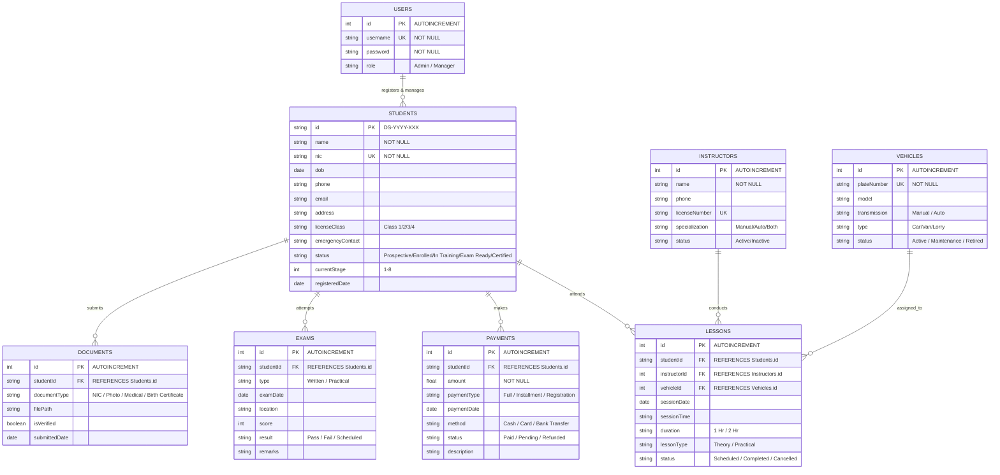

# LankaDrive - Entity Relationship Diagram

## Project Analysis Summary

**LankaDrive** is a Professional Driving School Management System built as an offline-first desktop application using Electron, React, and SQLite.

### Implemented Database Schema (Current)
- `Users` - Authentication & admin accounts
- `Students` - Student registry with 8-stage licensing pipeline

### Proposed Complete Schema (Based on Proposal & UI Design)
The following ER diagram represents the **full logical data model** covering all modules described in the project proposal: Authentication, Student Registry, Licensing Pipeline, Financial Management, and Resource/Fleet Management.

---

## Entity Relationship Diagram

---

## Entity Descriptions

### 1. USERS
Stores system administrator credentials for secure access.
- **Relationships**: One user can manage many students.
- **Current Status**: Implemented in `database.js`

### 2. STUDENTS
Central entity for student registration and progress tracking.
- **Key Fields**:
  - `id`: Unique driving school ID (e.g., `DS-2025-001`)
  - `nic`: National Identity Card (Unique)
  - `currentStage`: 1-8 pipeline tracker
  - `status`: Enrollment state
- **Current Status**: Implemented in `database.js`
- **Relationships**: Links to Payments, Lessons, Exams, Documents

### 3. INSTRUCTORS
Manages driving instructor profiles and availability.
- **Key Fields**:
  - `licenseNumber`: Instructor's driving license number
  - `specialization`: Manual, Auto, or Both
- **Current Status**: Proposed (referenced in UI mock data)

### 4. VEHICLES
Fleet management for training vehicles.
- **Key Fields**:
  - `plateNumber`: Vehicle registration (Unique)
  - `transmission`: Manual / Auto
- **Current Status**: Proposed (referenced in proposal)

### 5. PAYMENTS
Financial transaction logging for student fees.
- **Key Fields**:
  - `paymentType`: Full, Installment, or Registration fee
  - `amount`: Transaction value
- **Current Status**: Proposed (UI shows hardcoded demo data)

### 6. LESSONS
Training session scheduling and attendance.
- **Key Fields**:
  - `studentId`, `instructorId`, `vehicleId`: Linking entities
  - `lessonType`: Theory or Practical
- **Current Status**: Proposed (UI shows hardcoded demo data)

### 7. EXAMS
Tracks written and practical exam attempts.
- **Key Fields**:
  - `type`: Written or Practical
  - `result`: Pass, Fail, or Scheduled
- **Current Status**: Proposed (UI shows hardcoded demo data)

### 8. DOCUMENTS
Student document checklist and verification.
- **Key Fields**:
  - `documentType`: NIC, Photo, Medical, Birth Certificate
  - `isVerified`: Document verification status
- **Current Status**: Proposed (UI shows hardcoded demo data)

---

## 8-Stage Licensing Pipeline

As described in the proposal, students progress through these stages:

| Stage | Name | Description |
|-------|------|-------------|
| 1 | Registration | Initial enrollment |
| 2 | Medical | Medical examination clearance |
| 3 | Written Exam | Theory test completion |
| 4 | Learners Permit | Permit issued |
| 5 | Training Active | Practical driving lessons |
| 6 | Practical Exam | Driving test scheduled |
| 7 | Pass/Fail | Exam result recorded |
| 8 | License Issued | Full license obtained |

---

## Implementation Status

| Entity | Status | Location |
|--------|--------|----------|
| Users | Implemented | `database.js` |
| Students | Implemented | `database.js` |
| Instructors | Proposed | Future module |
| Vehicles | Proposed | Future module |
| Payments | Proposed | Future module |
| Lessons | Proposed | Future module |
| Exams | Proposed | Future module |
| Documents | Proposed | Future module |
