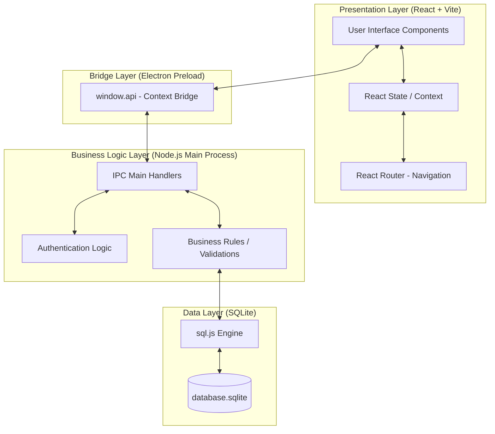
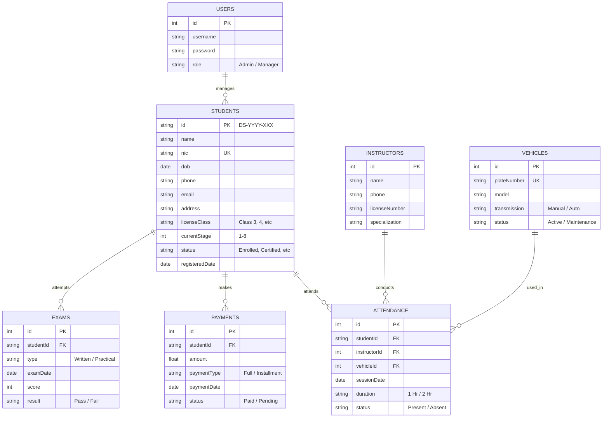
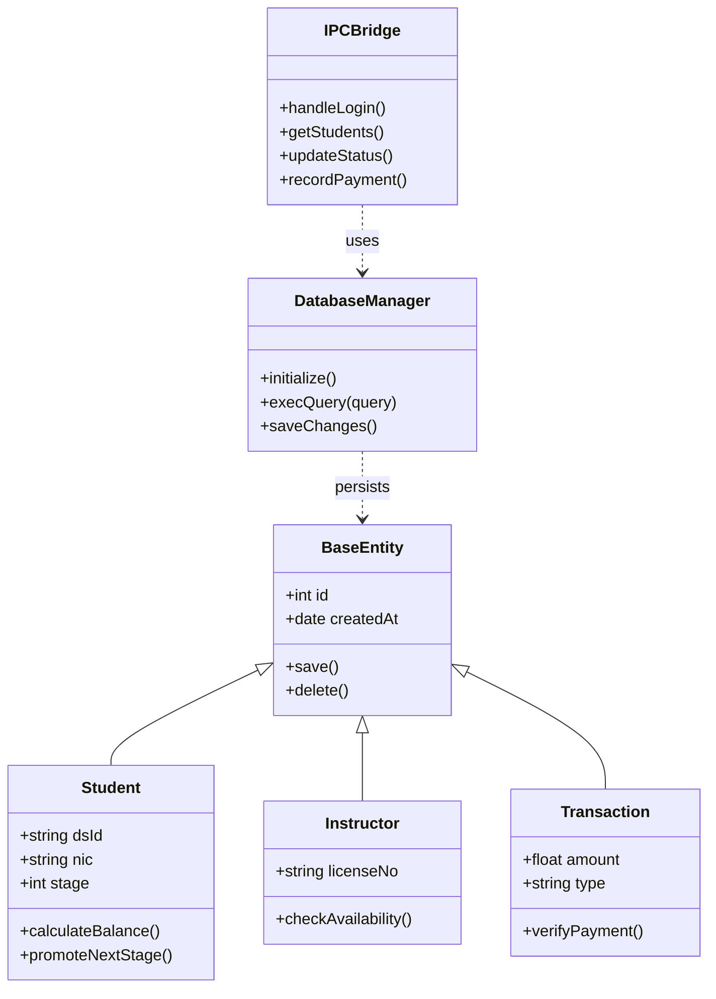
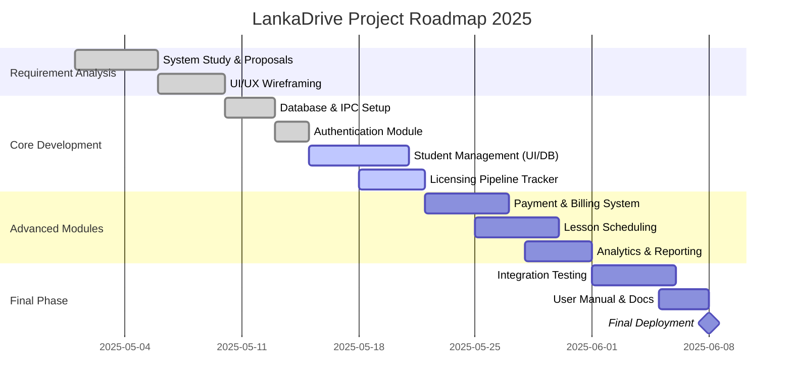

# LankaDrive - Advanced Project Documentation

This document contains high-fidelity system diagrams for the LankaDrive Driving School Management System.

## 1. System Architecture Diagram
A detailed view of the Desktop Application architecture using Electron, React, and SQLite.



## 2. Enhanced Entity Relationship Diagram (ERD)
The complete logical data model representing the driving school's data structure.



## 3. Improved Use Case Diagram
Organized by functional modules for better readability.

```mermaid
useCaseDiagram
    actor "System Administrator" as Admin
    
    package "Identity & Access" {
        usecase "Login to System" as UC1
        usecase "Manage User Accounts" as UC2
    }

    package "Student Lifecycle" {
        usecase "Student Registration" as UC3
        usecase "Track Pipeline Progress" as UC4
        usecase "Generate Learner Permit" as UC5
    }

    package "Operations" {
        usecase "Manage Instructors" as UC6
        usecase "Schedule Lessons" as UC7
        usecase "Record Attendance" as UC8
        usecase "Vehicle Maintenance Log" as UC9
    }

    package "Finance & Reporting" {
        usecase "Process Payments" as UC10
        usecase "View Analytics Dashboard" as UC11
        usecase "Generate Revenue Reports" as UC12
    }

    Admin --> UC1
    Admin --> UC2
    Admin --> UC3
    Admin --> UC4
    Admin --> UC5
    Admin --> UC6
    Admin --> UC7
    Admin --> UC8
    Admin --> UC9
    Admin --> UC10
    Admin --> UC11
    Admin --> UC12
```

## 4. Professional Class Diagram
Detailed methods and internal system layers.



## 5. Detailed Gantt Chart
Development roadmap from inception to deployment.


